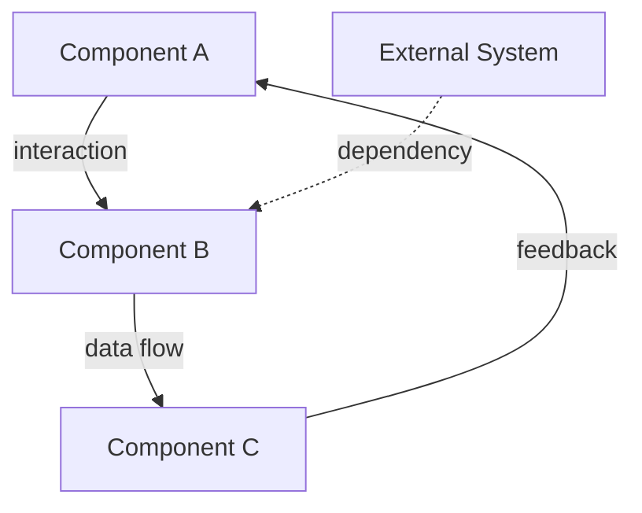

# Inception: Architect

Define system architecture and validate against established patterns. This is the third phase of the inception pipeline, focusing on **how** the system is structured.

**Rule: Validate against known patterns. Justify deviations. Document blind spots.**

## When to Use

Use this skill when:
- Solution scope is defined (from [inception_scope](../inception_scope/SKILL.md))
- Need to define system structure and components
- Need to validate architecture against best practices
- System complexity justifies formal architecture review

Skip this skill when:
- Solution is trivial (single script, config change)
- Architecture is already well-established in the codebase
- It's an extension of existing patterns (use [design_brainstorm](../design_brainstorm/SKILL.md) instead)

## Precondition: Complete RFC Exists

Before starting, ensure:
1. RFC file exists with Proposed Solution defined
2. Scope is clear (MVP, in/out decisions made)
3. No branch required — still in pre-development phase

## Certified Architecture Reference Repos

These repos are embedded as trusted pattern sources. Check them **first** before web search:

1. **ByteByteGoHq/system-design-101**
   - https://github.com/ByteByteGoHq/system-design-101
   - Visual system design explanations, common patterns

2. **donnemartin/system-design-primer**
   - https://github.com/donnemartin/system-design-primer
   - Comprehensive guide to system design, scalability patterns

3. **karanpratapsingh/system-design**
   - https://github.com/karanpratapsingh/system-design
   - System design concepts, case studies, patterns

4. **binhnguyennus/awesome-scalability**
   - https://github.com/binhnguyennus/awesome-scalability
   - Curated list of scalability, reliability, performance patterns

5. **mehdihadeli/awesome-software-architecture**
   - https://github.com/mehdihadeli/awesome-software-architecture
   - Software architecture patterns, practices, resources

**Plus web search** for domain-specific patterns not covered by certified repos.

## Workflow Steps

### 1. Load the RFC

**Read the existing RFC:**
- Locate: `docs/rfcs/RFC-XXX-YYYY-MM-DD-*.md`
- Review: Proposed Solution, scope, constraints
- Extract: Key requirements that drive architecture

### 2. Pattern discovery

**Research relevant architecture patterns:**

#### From certified repos
1. Search certified repos (listed above) for patterns matching:
   - Problem domain (e.g., "event-driven", "microservices", "batch processing")
   - Scale requirements (e.g., "high throughput", "low latency")
   - Constraints (e.g., "serverless", "on-premise")

2. Document relevant patterns found:
   - Pattern name
   - Source repo
   - When it applies
   - Key characteristics

#### From web search (if gaps remain)
- Domain-specific patterns (e.g., "ML pipeline architecture", "IoT data flow")
- Emerging patterns not yet in certified repos
- Vendor-specific best practices if using specific platforms

**Compile 2-4 relevant patterns.**

### 3. Pattern comparison matrix

**Create comparison matrix:**

| Pattern | Pros | Cons | Fit for Our Constraints | Complexity |
|---------|------|------|-------------------------|------------|
| Pattern A | ... | ... | Good/Partial/Poor | Low/Med/High |
| Pattern B | ... | ... | Good/Partial/Poor | Low/Med/High |
| ... | ... | ... | ... | ... |

**Present to user:**
> "Here are the established patterns that could work. Which direction feels right for our constraints?"

**Guide the user to choose or blend patterns.**

### 4. Component topology

**Define major components and their relationships:**

#### Identify components
- What are the major building blocks?
- What are their responsibilities?
- How do they interact?

#### Define boundaries
- What's inside each component?
- What's the interface between components?
- What data flows between them?

#### Create topology diagram

**Present to user and iterate.**

### 5. Technology stack evaluation

**For each component, decide technology choices:**

#### Language/Framework
- What language fits this component? (consider: team skills, ecosystem, performance)
- What framework/library? (consider: maturity, community, fit)

#### Infrastructure
- How is it deployed? (container, serverless, VM, etc.)
- What services does it use? (databases, queues, caches, etc.)

#### Build vs Buy (revisit from scope phase)
- Custom implementation or existing tool?
- If existing, which specific tool/service?

**Document rationale for each choice.**

### 6. Blind spot check

**Challenge the design against common blind spots:**

**Prompt (internal checklist, ask user about gaps):**
- **Observability**: How do we debug this in production? Logging? Metrics? Tracing?
- **Security**: Authentication? Authorization? Data protection? Secrets management?
- **Scalability**: What happens at 10x load? 100x?
- **Reliability**: What fails? How do we recover? What's the blast radius?
- **Data consistency**: How do we handle concurrent updates? What's the consistency model?
- **Testing**: How do we test this? Unit? Integration? E2E?
- **Deployment**: How do we roll out? Rollback? Blue/green? Canary?
- **Configuration**: How do we configure different environments?
- **Secrets**: How do we manage credentials, tokens, keys?
- **Monitoring**: What alerts do we need? What's the on-call playbook?

**For each blind spot identified:**
> "I notice we haven't addressed [X]. How should we handle that?"

**Document the answers in the design.**

### 7. Deviation justification

**If the design deviates from standard patterns:**

**Identify deviations:**
- Where does our design differ from established patterns?
- Why? (unique constraints, special requirements)

**Document justification:**
- Why we're deviating
- What we considered
- What risks we're accepting
- How we'll mitigate

**This prevents "not invented here" syndrome and makes trade-offs explicit.**

### 8. Create the Design Document

Create a new design document:

1. **Create file**: `docs/designs/DES-XXX-YYYY-MM-DD-<kebab-case-title>.md`
2. **Use template**: [DESIGN template](../../../docs/templates/DESIGN.md)
3. **Fill sections**:
   - Overview: Link to RFC, summarize architecture approach
   - Architecture: System context, key decisions, pattern chosen
   - Components: Each component with responsibility, interface, implementation notes
   - Data Flow: Happy path and error paths
   - Component Topology: Mermaid diagram
   - Technology Stack: Languages, frameworks, build vs buy decisions
   - Testing Strategy: Unit, integration, E2E approach
   - Security/Performance/Error Handling: Blind spot answers
   - Deployment/Monitoring: Operational concerns

### 9. Review with user

**Present the design document:**
> "Here's the system design. Does this architecture make sense? What concerns do you have?"

**Iterate** until the user approves.

### 10. Decide: Continue to planning or stop

**Prompt:**
> "The architecture is defined. Should we continue to decompose this into issues, or pause for broader review?"

**If continue:** Proceed to [inception_plan](../inception_plan/SKILL.md)

**If pause:** Save design doc, create RFC/design review issue, hand off to team

**If stop/pivot:** Update RFC and design status, document why

## Important Notes

- **Don't reinvent.** Use established patterns unless there's a compelling reason not to.
- **Justify deviations.** If you deviate from patterns, document why.
- **Check blind spots.** Systems fail in the gaps we don't think about.
- **Be skeptical of novelty.** New ≠ better. Boring technology is often the right choice.
- **Validate with patterns.** The certified repos are your first source of truth.

## Outputs

- Design document in `docs/designs/` with complete architecture
- Component topology diagram
- Technology stack decisions with rationale
- Blind spots addressed
- Deviations justified

## Next Phase

After user approval, invoke [inception_plan](../inception_plan/SKILL.md) to decompose into GitHub issues.
